# LABORATORIO 1
Configurar y usar Git como sistema de control de versiones de un proyecto personal.
## a)	Configurar y usar Git localmente
   En base al siguiente tutorial: http://www.gabrielsaldana.org/platica_git.pdf  
   
   Nos situamos en la carpeta en la que queremos trabajar. Nos aseguramos con pwd, para saber dónde estamos.
   Ahora con git init inicializa el repositorio:
   

      
   

   
   Agregamos todos los archivos al repositorio.
   

      
   

   
   * Realizar cambios
   

      
   

   
   * Crear ramas
   

      
   

   
   * Hacer merges
   

      
   

   
   * Revisar historial
   

      
   

   
   * Regresar a la version anterior
   

      
   

   
## b)	Configurar y usar GitHub
   En base al siguiente tutorial: https://www.freecodecamp.org/news/the-beginners-guide-to-git-github/
   ### Tipo 1 : cree el repositorio, clónelo en su PC y trabaje en él (recomendado)
   El tipo 1 implica crear un repositorio totalmente nuevo en GitHub, clonarlo en nuestra computadora, trabajar en nuestro proyecto y rechazarlo.
   * Cree un nuevo repositorio haciendo clic en el botón "nuevo repositorio" en la página web de GitHub.
   * Elija un nombre para su primer repositorio, agregue una pequeña descripción, marque la casilla "Inicializar este repositorio con un README" y haga clic en el botón "Crear     repositorio".
   

      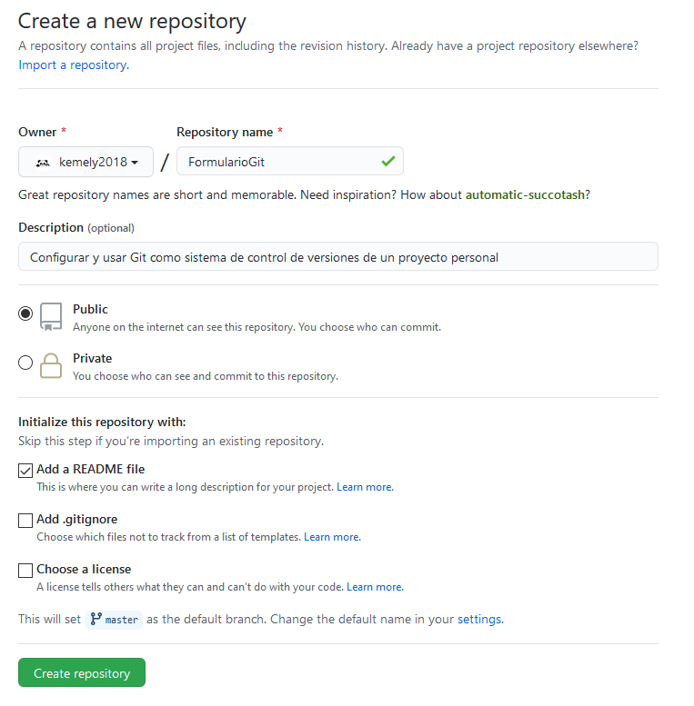
   

   
   ¡Bien hecho! Se creo su repositorio de GitHub.  
   Su primera misión es obtener una copia del repositorio en su computadora. Para hacer eso, necesita "clonar" el repositorio en su computadora.  
   * Clonar un repositorio significa que está tomando un repositorio que está en el servidor y lo clona en su computadora, al igual que descargarlo. En la página del repositorio,  debe obtener la dirección "HTTPS".
   

      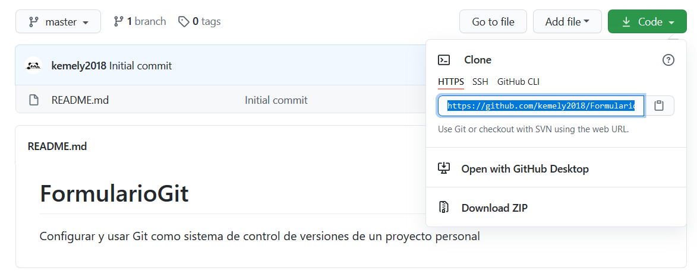
   

   
   * Una vez que tenga la dirección del repositorio, debe usar su terminal. Utilice el siguiente comando en su terminal. Cuando esté listo, puede ingresar esto:  
   `git clone [HTTPS ADDRESS]` 
     Este comando hará una copia local del repositorio alojado en la dirección dada. 
     Ahora, su repositorio está en su computadora. Debes moverte en él con el siguiente comando. 
     `cd [NAME OF REPOSITORY]`
     

        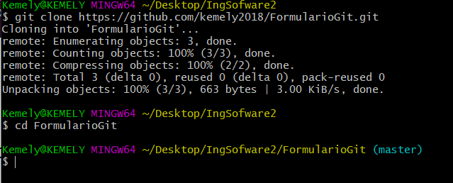
     

     
   * Ahora, en la terminal, estás en el directorio de tu repositorio. Hay 4 pasos en un compromiso: ‘status’ , ‘add’ , ‘commit’ and ‘push’. Todos los siguientes pasos deben realizarse dentro de su proyecto. Repasemos uno por uno.
     #### “status”
     Lo primero que debe hacer es verificar los archivos que ha modificado. Para hacer esto, puede escribir el siguiente comando para que aparezca una lista de cambios.
     

        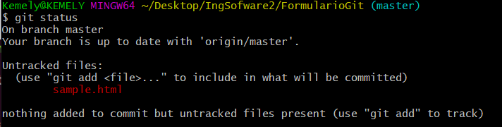
     

     
     #### “add”
     Con la ayuda de la lista de cambios, puede agregar todos los archivos que desea cargar con el siguiente comando: 
     `git add [FILENAME] [FILENAME] [...]` 
     En nuestro caso, agregaremos un archivo HTML simple. 
     `git add sample.html`
     

        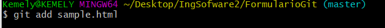
     
     
     
     #### “commit”
     Ahora que hemos agregado los archivos de nuestra elección, necesitamos escribir un mensaje para explicar lo que hemos hecho. Este mensaje puede resultar útil más adelante si queremos consultar el historial de cambios. Aquí tienes un ejemplo de lo que podemos poner en nuestro caso. 
     `git commit -m "Added sample HTML file that contain basic syntax"` 
     

        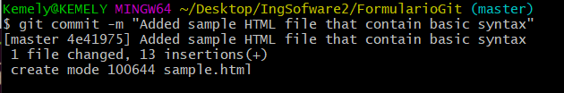
     
  
     
     #### “push”
     Ahora podemos poner nuestro trabajo en GitHub. Para hacer eso, tenemos que "push" nuestros archivos a Remote. Remote es una instancia duplicada de nuestro repositorio que vive en otro lugar de un servidor remoto. Para hacer esto, debemos saber el nombre del remote control (en su mayoría remoto se llama origin). Para averiguar ese nombre, escriba el siguiente comando. 
     `git remote` 
     

        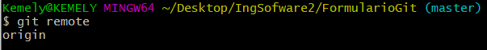
     
  
     
     Como puede ver en la imagen de arriba, el nombre de nuestro remote control es origin. Ahora podemos "push" nuestro trabajo de forma segura con el siguiente comando. 
     `git push origin master` 
     

        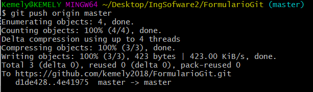
     
  
     
     Ahora, si vamos a nuestro repositorio en la página web de GitHub, podemos ver el archivo sample.html que hemos enviado al remote control: ¡GitHub! 
     

        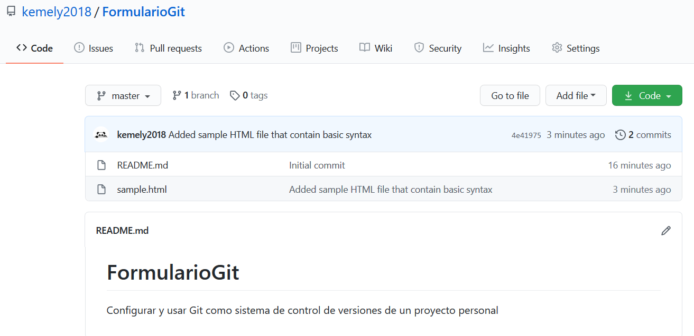
     
  
   ### Tipo 2: Trabaje en su proyecto localmente, luego cree el repositorio en GitHub y envíelo a remote control .
   El tipo 2 le permite crear un repositorio nuevo desde una carpeta existente en nuestra computadora y enviarlo a GitHub. En muchos casos, es posible que ya haya creado algo en su computadora que desee convertir repentinamente en un repositorio en GitHub. 
   Por defecto, cualquier directorio de nuestra computadora no es un repositorio de Git, pero podemos convertirlo en un repositorio de Git. 
   Después de convertir nuestro directorio a un repositorio de Git, lo primero que debemos hacer es verificar los archivos que tenemos. 
   Entonces, hay  archivos en ese directorio que necesitamos "add" a nuestro Repo. 
   NOTA: Para "add" todos los archivos en nuestro Repositorio podemos usar el siguiente comando: 
   `git add .` 
   Una vez que se completa el área de preparación (el proceso de adición), podemos verificar si los archivos se agregaron correctamente o no ejecutando el estado de git 
   Si esos archivos en particular están en verde , ¡ha hecho su trabajo!
   Entonces tenemos que "commit" con una descripción en ella. 
   

      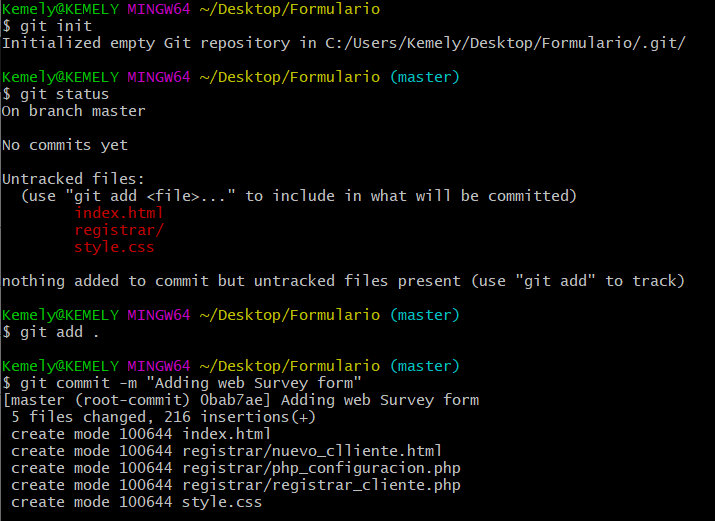
   
    
   
   Entonces, para agregar ese remote contro, primero tenemos que ir a GitHub. Cree un nuevo repositorio y asígnele el nombre que desee para almacenarlo en GitHub. Luego haga clic en el botón "Crear repositorio". 
   NOTA: En el Tipo 2, no inicialice el repositorio con un archivo README cuando cree un nuevo repositorio en la página web de GitHub. 
   

      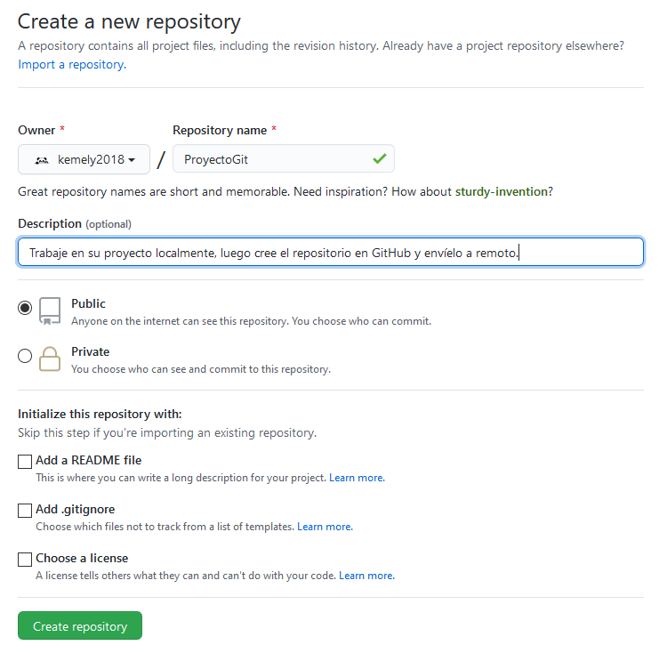
   
  
   
   Después de hacer clic en el botón "Crear repositorio", encontrará la siguiente imagen como una página web.
   

      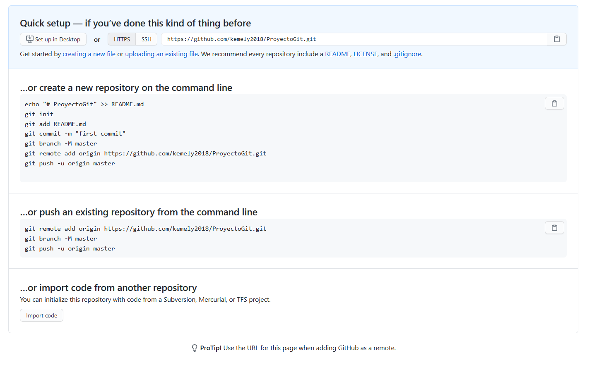
   
 

   Copie la dirección HTTPS. Ahora crearemos el remote control para nuestro repositorio. 
   `git remote add origin [HTTPS ADDRESS]` 
   Después de ejecutar este comando, podemos verificar si hemos agregado exitosamente el control remoto o no mediante el siguiente comando. 
   `git remote` 
   Y si genera "origin", ha agregado el control remoto a su proyecto. 
   ¡Ahora podemos enviar nuestro proyecto a GitHub sin ningún problema! 
   `git push origin master` 
   

      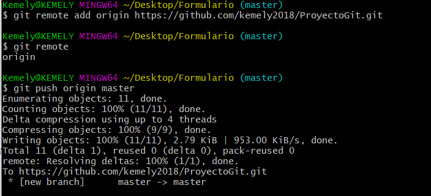
   
 
   
   Después de completar estos pasos uno por uno, si vas a GitHub puedes encontrar tu repositorio con los archivos.
   
