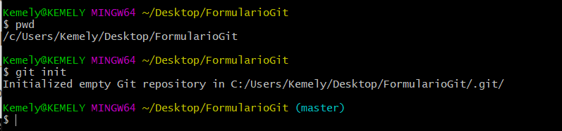
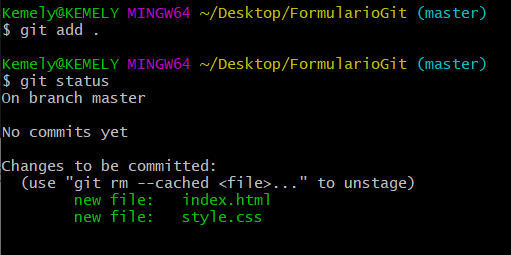
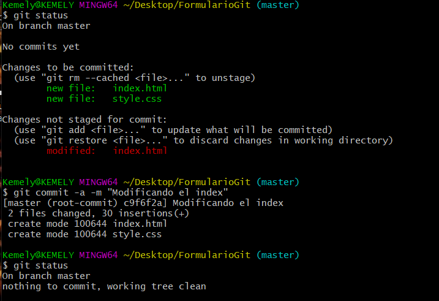
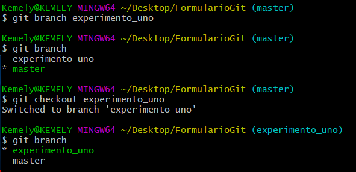
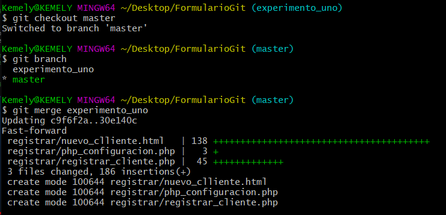
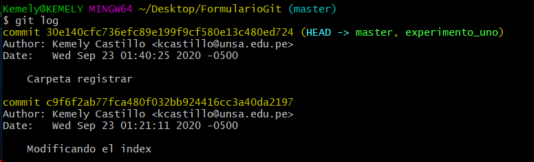
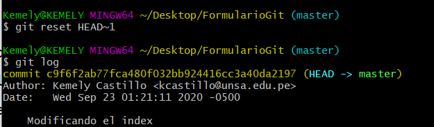

# LABORATORIO 1
Configurar y usar Git como sistema de control de versiones de un proyecto personal.
## a)	Configurar y usar Git localmente
   En base al siguiente tutorial: http://www.gabrielsaldana.org/platica_git.pdf  
   
   Nos situamos en la carpeta en la que queremos trabajar. Nos aseguramos con pwd, para saber dónde estamos.
   Ahora con git init inicializa el repositorio:
   

      
   

   
   Agregamos todos los archivos al repositorio.
   

      
   

   
   * Realizar cambios
   

      
   

   
   * Crear ramas
   

      
   

   
   * Hacer merges
   

      
   

   
   * Revisar historial
   

      
   

   
   * Regresar a la version anterior
   

      
   

   
## b)	Configurar y usar GitHub
   En base al siguiente tutorial: https://www.freecodecamp.org/news/the-beginners-guide-to-git-github/

